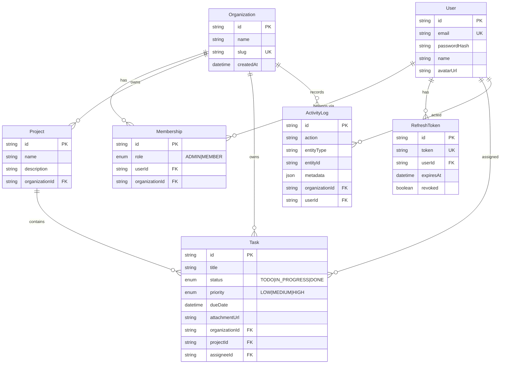

# TeamFlow — Database ER Diagram

Shared-database multi-tenancy: every tenant-owned table carries `organizationId`.

## Key design decisions

- **`Membership` join table** — a `User` can belong to multiple `Organization`s with a distinct
  role in each. The JWT carries the *active* `organizationId`, so switching orgs = new token.
- **`organizationId` everywhere** — `Project`, `Task`, and `ActivityLog` all denormalize the org id
  so every list/detail query can filter by tenant with a single indexed column (no deep joins).
- **`RefreshToken` in DB** — enables rotation + revocation (true logout), unlike stateless-only JWT.
- **`assigneeId` is nullable** with `onDelete: SetNull` — removing a member doesn't delete their tasks.
- Indexes on `organizationId`, `projectId`, `status`, and `createdAt` back the common filters.
